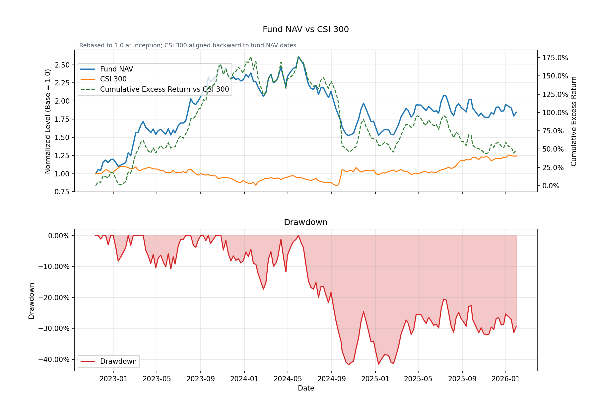
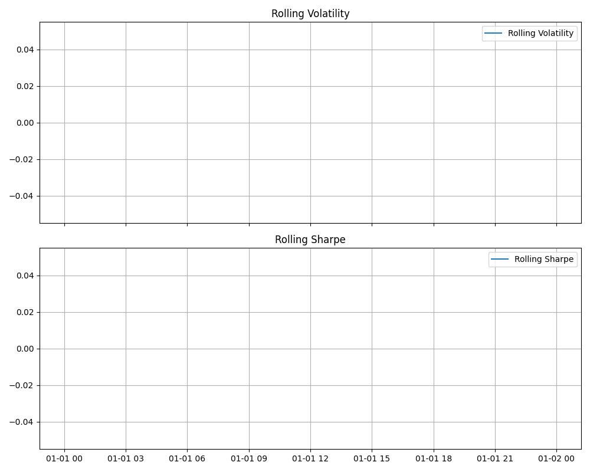

# 📊 Fund NAV-Based Risk Analytics (In Progress)

A lightweight Python project for analyzing portfolio risk based on fund NAV (Net Asset Value) time series.

This project simulates a practical buy-side risk monitoring workflow by transforming raw NAV data into return-based, path-dependent, and rolling risk metrics, with clear visualizations for portfolio analysis.

---

## 🧭 Project Overview

In investment risk management, NAV time series provide a direct view of portfolio performance over time.

This project builds a structured analytics pipeline to evaluate portfolio risk using NAV-based data.

### Workflow

- Load NAV time series data
- Compute daily and cumulative returns
- Calculate risk metrics
- Analyze drawdowns
- Monitor rolling risk dynamics
- Generate visualizations

---

## 🚀 Key Features

### 1. Return Calculation
- Daily Return
- Cumulative Return

### 2. Static Risk Metrics
- Annualized Return
- Annualized Volatility
- Sharpe Ratio

### 3. Path-Dependent Risk
- Drawdown Series
- Maximum Drawdown

### 4. Rolling Risk Monitoring
- Rolling Volatility
- Rolling Sharpe Ratio

### 5. Visualization
- NAV Curve
- Drawdown Curve
- Rolling Risk Metrics

---

## 🧱 Project Structure

    fund-risk-analytics/
    │
    ├── data/
    │   └── sample_nav.csv
    │
    ├── notebooks/
    │   └── eda.ipynb
    │
    ├── output/
    │   ├── charts/
    │   │   ├── nav_drawdown.png
    │   │   └── rolling_metrics.png
    │   └── reports/
    │
    ├── scripts/
    │   └── run_analysis.py
    │
    ├── src/
    │   ├── data_loader.py
    │   ├── return_calculator.py
    │   ├── risk_metrics.py
    │   ├── drawdown.py
    │   ├── rolling_metrics.py
    │   └── visualization.py
    │
    ├── README.md
    ├── requirements.txt
    └── .gitignore

---

## 🧠 Methodology

### Step 1: Load NAV Data
NAV data is imported from a CSV file and indexed by date for time-series analysis.

### Step 2: Calculate Returns

**Daily Return**

r_t = (NAV_t / NAV_(t-1)) - 1

**Cumulative Return**

Compounded from daily returns.

### Step 3: Static Risk Metrics

- Annualized Return
- Annualized Volatility
- Sharpe Ratio

These summarize overall performance and risk-adjusted return.

### Step 4: Drawdown Analysis

Drawdown_t = NAV_t / max(NAV_1:t) - 1

- Measures peak-to-trough loss
- Maximum Drawdown = worst observed loss

### Step 5: Rolling Risk Metrics

- Rolling Volatility
- Rolling Sharpe Ratio

Captures **time-varying risk dynamics**.

### Step 6: Visualization

Charts are generated and saved under:

    output/charts/

---

## 📊 Data

The current version of this project uses simulated/sample NAV data for demonstration purposes.

This allows for a controlled environment to develop and validate the risk analytics framework.

In future iterations, the model can be extended to incorporate real-world fund data for more practical applications.

---

## 📈 Sample Output

### NAV & Drawdown

### Rolling Risk Metrics

---

## 📊 Example Risk Metrics

Based on sample data:

- Annualized Return: **564.88%**
- Annualized Volatility: **21.31%**
- Sharpe Ratio: **26.50**
- Maximum Drawdown: **-0.98%**

> ⚠️ Note:
> These values are based on a short sample dataset and are for demonstration purposes only.
> Real-world analysis requires longer time horizons for meaningful annualized and rolling statistics.

---

## ⚙️ How to Run

### 1. Clone the repository

    git clone <https://github.com/ycssup/portfolio-risk-analytics-and-performance-attribution-framework-for-fund-investments.git>
    cd fund-risk-analytics

### 2. Install dependencies

    pip install -r requirements.txt

### 3. Run analysis

    python scripts/run_analysis.py

---

## 📂 Input Data Format

    date,nav
    2020-01-01,1.00
    2020-01-02,1.01
    2020-01-03,1.02

Required columns:

- `date`
- `nav`

---

## 🎯 Why This Project Matters

This project reflects a practical risk monitoring framework used in asset management.

It distinguishes between:

### 🔹 Return-Based Risk
- Volatility
- Sharpe Ratio

### 🔹 Path-Dependent Risk
- Drawdown
- Maximum Drawdown

This distinction is important because different metrics capture different dimensions of portfolio risk.

By incorporating rolling metrics, the project moves beyond static reporting into **dynamic risk monitoring**.

---

## 🔮 Future Enhancements

- Benchmark comparison
- Value at Risk (VaR)
- Conditional Value at Risk (CVaR)
- Sortino Ratio
- Calmar Ratio
- Multi-asset portfolio support
- Factor attribution (Barra-style)
- Streamlit dashboard deployment

---

## 🛠 Tech Stack

- Python
- pandas
- numpy
- matplotlib

---

## 👤 Author

This project demonstrates the application of Python in investment risk management, portfolio analytics, and data-driven decision-making.
