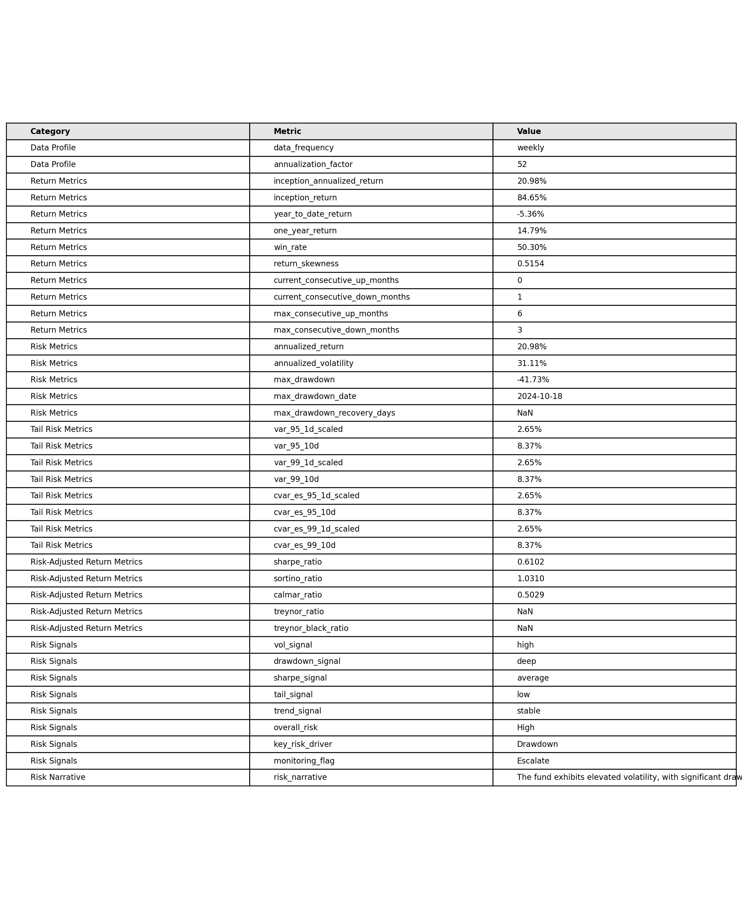
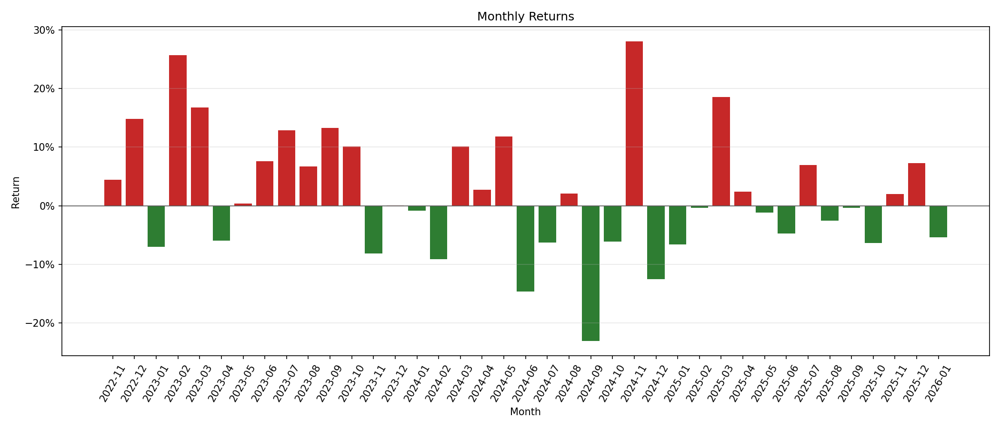
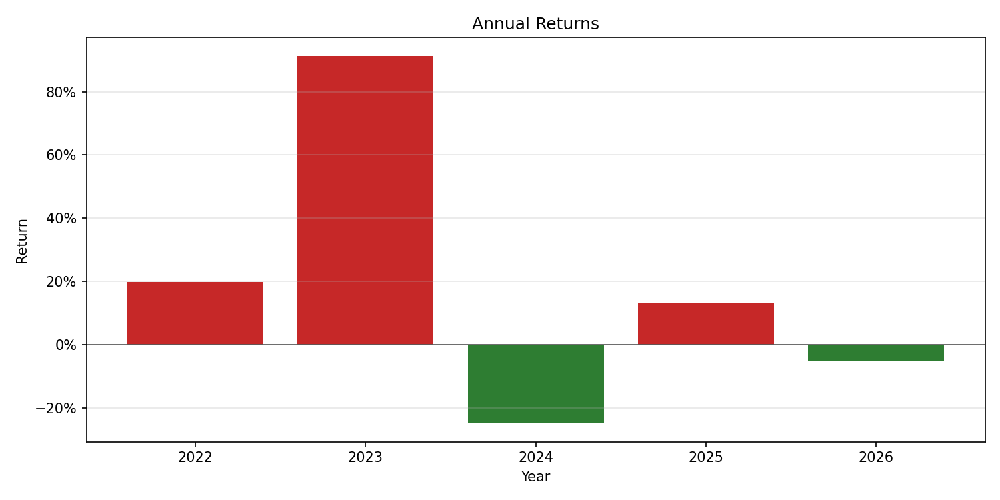
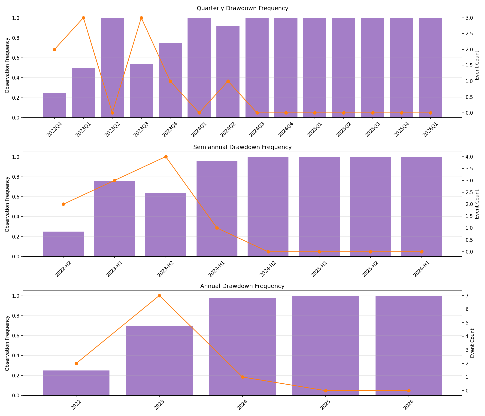

# 📊 Fund NAV-Based Risk Analytics

A Python project for analyzing fund performance and risk based on NAV (Net Asset Value) time series.

The workflow is designed for practical fund risk monitoring: load NAV data, identify the data frequency first, calculate return/risk/drawdown metrics, and generate visual reports.

---

## 🧭 Project Overview

The first step of the analysis is always to determine the NAV data frequency:

- Daily data: annualization factor = `252`
- Weekly data: annualization factor = `52`
- Monthly data: annualization factor = `12`
- Other regular frequency: annualization factor is estimated from the median date interval

All downstream return, volatility, rolling, VaR/CVaR, and risk-adjusted return calculations use this detected frequency.

Rolling metrics use frequency-aware windows:

- Daily data: `60`, `120`, and `252` observations
- Weekly data: `12`, `26`, and `52` observations
- Monthly data: `6`, `12`, and `24` observations

---

## 🚀 Key Features

### 1. Data Frequency Detection

- Automatically detects daily, weekly, monthly, or custom NAV frequency
- Uses strict mode in the main analysis script
- Stops the workflow if frequency cannot be inferred from valid dates

### 2. Return Metrics

- Periodic return
- Cumulative return
- Inception return
- Inception annualized return
- Year-to-date return
- Trailing one-year return
- Win rate
- Return distribution skewness
- Current and maximum consecutive up/down months
- Monthly returns
- Annual returns

### 3. Risk Metrics

- Annualized return
- Annualized volatility
- Historical VaR at 95% and 99% confidence
- 1-day scaled VaR and 10-day VaR
- CVaR / Expected Shortfall at 95% and 99% confidence
- 1-day scaled CVaR/ES and 10-day CVaR/ES

### 4. Risk-Adjusted Return Metrics

- Sharpe ratio
- Sortino ratio
- Calmar ratio
- Treynor ratio
- Treynor-Black ratio

> Treynor ratio and Treynor-Black ratio require a benchmark return column named `benchmark_return`. If the uploaded data does not include benchmark returns, these metrics return `NaN`.

### 5. Drawdown Analysis

- Drawdown series
- Maximum drawdown
- Maximum drawdown date
- Maximum drawdown recovery days
- Drawdown frequency by quarter
- Drawdown frequency by half year
- Drawdown frequency by year

### 6. Visualization and Reports

- Metrics summary table
- NAV and drawdown chart
- Rolling volatility and rolling Sharpe chart
- Monthly return bar chart
- Annual return bar chart
- Return analysis report page combining:
  - annual return chart
  - monthly return chart
  - yearly monthly-return heatmap table
  - annual return column
  - yearly win-rate column
  - positive returns shown in red
  - negative returns shown in green
- Drawdown frequency chart
- Metrics summary CSV report
- PDF fund risk assessment report
- Natural-language commentary and conclusion pages in the PDF report

### 7. Absolute Risk Interpretation Layer

- Rule-based absolute risk signals
- `vol_signal`: low / medium / high
- `drawdown_signal`: shallow / moderate / deep
- `sharpe_signal`: strong / average / weak
- `tail_signal`: low / elevated / high
- `trend_signal`: improving / deteriorating / stable
- `overall_risk`: Low / Moderate / High
- `key_risk_driver`: Drawdown / Volatility / Tail Risk / Multiple Factors / Balanced
- `monitoring_flag`: Normal / Watch / Escalate

### 8. Narrative Layer

- Deterministic risk commentary generated from the signal engine
- Professional report paragraph summarizing:
  - volatility and drawdown
  - risk-adjusted performance
  - trend condition
  - overall risk conclusion

---

## 🧱 Project Structure

    fund-risk-analytics/
    │
    ├── data/
    │   └── sample_nav_data.xlsx
    │
    ├── notebooks/
    │   └── eda.ipynb
    │
    ├── output/
    │   ├── charts/
    │   │   ├── metrics_summary_table.png
    │   │   ├── nav_drawdown.png
    │   │   ├── rolling_metrics.png
    │   │   ├── monthly_returns.png
    │   │   ├── annual_returns.png
    │   │   └── drawdown_frequency.png
    │   └── reports/
    │       ├── metrics_summary_table.csv
    │       └── fund_risk_report.pdf
    │
    ├── scripts/
    │   ├── run_analysis.py
    │   └── generate_report.py
    │
    ├── src/
    │   ├── data_loader.py
    │   ├── frequency.py
    │   ├── signal_engine.py
    │   ├── narrative_engine.py
    │   ├── return_metrics.py
    │   ├── risk_metrics.py
    │   ├── risk_adjusted_return.py
    │   ├── drawdown_analysis.py
    │   ├── rolling_metrics.py
    │   ├── data_sanitization.py
    │   └── visualization.py
    │
    ├── README.md
    ├── requirements.txt
    └── .gitignore

---

## 🧠 Methodology

### Step 1: Load NAV Data

NAV data is loaded from CSV or Excel.

Required columns:

- `date`
- `nav`

### Step 2: Detect Data Frequency

The workflow calls:

```python
infer_data_frequency(df, strict=True)
```

This happens before any return or risk calculation.

### Step 3: Calculate Returns

Periodic return:

```text
r_t = NAV_t / NAV_(t-1) - 1
```

Cumulative return:

```text
cum_return_t = product(1 + r_t) - 1
```

### Step 4: Calculate Risk and Risk-Adjusted Return Metrics

Annualization uses the detected frequency. For example, weekly data uses `52`, not `252`.

Tail risk metrics use historical simulation. Multi-day VaR and CVaR/ES are scaled from the detected observation frequency to the requested holding period.

For non-daily data, short-horizon tail-risk labels such as `1d_scaled` are reported explicitly as scaled estimates rather than directly observed daily losses.

### Step 5: Drawdown Analysis

Drawdown:

```text
drawdown_t = NAV_t / max(NAV_1:t) - 1
```

Maximum drawdown recovery days are measured from the maximum drawdown trough date to the first later date where NAV recovers to the previous high.

### Step 6: Visualization

All charts and summary tables are generated from `src/visualization.py`.

### Step 7: Risk Signals and Narrative

The workflow then converts raw metrics into qualitative absolute risk signals and a deterministic narrative:

- raw metrics -> single signals -> overall judgment -> narrative

This layer is implemented in:

- `src/signal_engine.py`
- `src/narrative_engine.py`

---

## 📈 Latest Sample Output

The current `scripts/run_analysis.py` run uses `data/sample_nav_data.xlsx`.

Detected data profile:

- Data Frequency: **weekly**
- Annualization Factor: **52**
- Rolling Windows: **12, 26, 52**

### Return Metrics

- Inception Annualized Return: **20.98%**
- Inception Return: **84.65%**
- Year-to-Date Return: **-5.36%**
- Trailing One-Year Return: **14.79%**
- Win Rate: **50.30%**
- Return Skewness: **0.5154**
- Current Consecutive Up Months: **0**
- Current Consecutive Down Months: **1**
- Max Consecutive Up Months: **6**
- Max Consecutive Down Months: **3**

### Risk Metrics

- Annualized Return: **20.98%**
- Annualized Volatility: **31.11%**
- Maximum Drawdown: **-41.73%**
- Maximum Drawdown Date: **2024-10-18**
- Maximum Drawdown Recovery Days: **Not recovered**

### Tail Risk Metrics

- VaR 95% 1-day scaled: **2.65%**
- VaR 95% 10-day: **8.37%**
- VaR 99% 1-day scaled: **2.65%**
- VaR 99% 10-day: **8.37%**
- CVaR/ES 95% 1-day scaled: **2.65%**
- CVaR/ES 95% 10-day: **8.37%**
- CVaR/ES 99% 1-day scaled: **2.65%**
- CVaR/ES 99% 10-day: **8.37%**

### Risk-Adjusted Return Metrics

- Sharpe Ratio: **0.6102**
- Sortino Ratio: **1.0310**
- Calmar Ratio: **0.5029**
- Treynor Ratio: **NaN**
- Treynor-Black Ratio: **NaN**

Treynor metrics are `NaN` because the current input file does not include `benchmark_return`.

### Risk Signals

- Vol Signal: **high**
- Drawdown Signal: **deep**
- Sharpe Signal: **average**
- Tail Signal: **low**
- Trend Signal: **stable**
- Overall Risk: **High**
- Key Risk Driver: **Drawdown**
- Monitoring Flag: **Escalate**

### Risk Narrative

> The fund exhibits elevated volatility, with significant drawdown pressure. The fund shows moderate risk-adjusted performance, while risk conditions remain stable. Overall, the portfolio is assessed as High risk, primarily driven by drawdown pressure. Monitoring status: Escalate.

---

## 📊 Generated Outputs

### Metrics Summary Table



### NAV and Drawdown


### Rolling Risk Metrics


### Monthly Returns



### Annual Returns



### Return Analysis Page

The PDF report includes a combined **Return Analysis** page:

- upper half: annual return chart + monthly return chart
- lower half: yearly monthly-return heatmap table
- table includes annual return and yearly win rate
- positive returns shown in red
- negative returns shown in green

### Drawdown Frequency



The metrics summary is also exported as:

```text
output/reports/metrics_summary_table.csv
```

The PDF report is exported as:

```text
output/reports/fund_risk_report.pdf
```

The PDF report includes:

- cover page
- automated commentary pages
- metrics summary table
- risk commentary page
- combined return analysis page
- charts
- final conclusion / risk notes page

---

## ⚙️ How to Run

### 1. Install dependencies

```bash
pip install -r requirements.txt
```

### 2. Run analysis

```bash
python scripts/run_analysis.py
```

The script will:

1. Load NAV data
2. Detect data frequency
3. Calculate return metrics
4. Calculate rolling metrics
5. Calculate risk and risk-adjusted return metrics
6. Calculate drawdown metrics
7. Generate absolute risk signals
8. Generate deterministic risk narrative
9. Generate charts and reports

### 3. Generate PDF report

```bash
python scripts/generate_report.py
```

The default input file is:

```text
data/sample_nav_data.xlsx
```

You can also specify a CSV, XLSX, or XLS file:

```bash
python scripts/generate_report.py --input data/sample_nav_data.xlsx --output output/reports/fund_risk_report.pdf
```

---

## 📂 Input Data Format

The analysis scripts support CSV, XLSX, and XLS files. XLSX files use `openpyxl`; XLS files require `xlrd`.

Minimum required format:

```csv
date,nav
2020-01-01,1.00
2020-01-02,1.01
2020-01-03,1.02
```

Optional benchmark format for Treynor metrics:

```csv
date,nav,benchmark_return
2020-01-01,1.00,
2020-01-02,1.01,0.005
2020-01-03,1.02,0.004
```

---

## 🛠 Tech Stack

- Python
- pandas
- numpy
- matplotlib
- openpyxl
- xlrd

---

## Notes

The current sample results are based on the data file used by `scripts/run_analysis.py` at runtime. Different uploaded NAV files will produce different metrics, and the annualization factor will change automatically based on the detected data frequency.
