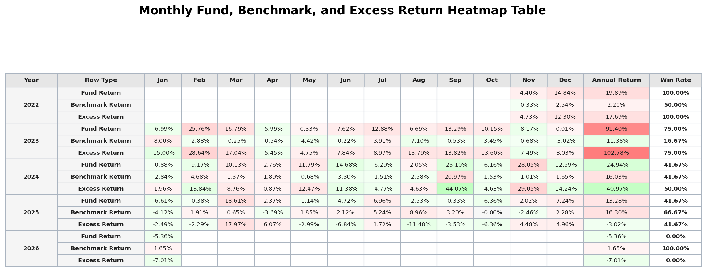

# 📊 Fund Risk Analytics Pipeline

## 🧭 Project Overview

Fund Risk Analytics Pipeline is a benchmark-aware portfolio risk monitoring workflow built around fund NAV time series. It ingests fund and benchmark data, aligns the benchmark to the fund's reporting schedule, calculates absolute and relative performance metrics, generates visualization outputs, and produces a polished PDF risk report.

This project is designed to resemble a practical buy-side monitoring process rather than a classroom-style analytics exercise. In a real investment setting, analysts rarely evaluate a fund in isolation. They need to understand how the fund behaved relative to its benchmark, how risk evolved through time, whether excess return justified active risk, and how to communicate those findings in a format that portfolio managers, investment committees, and non-technical stakeholders can actually consume.

The pipeline reflects that workflow:

- NAV-based analytics rather than simulated toy return data
- benchmark-aware alignment and relative performance monitoring
- automated charts, summary tables, heatmaps, and commentary
- one-command execution for repeatable reporting, including a no-argument default mode with bundled sample files

In short, this repository is a practical example of risk analytics, benchmark integration, and reporting automation for fund surveillance.

## 🚀 Key Features

### 1. Fund and Benchmark Data Alignment

The project treats fund NAV dates as the master analysis calendar.

- Fund NAV dates define the analysis timeline
- Benchmark data may be higher frequency than the fund series
- For each fund date, the benchmark is aligned backward using the most recent available benchmark observation on or before that date
- Future benchmark values are never used
- This avoids forward-looking bias and makes benchmark-relative analytics defensible

This alignment logic is important in real-world fund monitoring because benchmark data and fund NAVs often arrive on different schedules.

### 2. Risk and Return Analytics

The pipeline computes a broad set of fund-level performance and risk metrics from the aligned dataset.

- Inception return
- Inception annualized return
- Year-to-date return
- One-year return
- Win rate
- Return skewness
- Annualized return
- Annualized volatility
- Maximum drawdown and recovery information
- Rolling volatility and rolling Sharpe metrics
- Tail risk measures including historical VaR and CVaR / Expected Shortfall

The tail-risk implementation uses historical simulation on the observed return series:

- 95% VaR uses the 5th percentile of returns
- 99% VaR uses the 1st percentile of returns
- CVaR / Expected Shortfall is computed as the mean of returns at or below the corresponding VaR threshold
- Tail-risk metrics are reported as positive loss numbers for readability

The implementation is frequency-aware. Metrics are not hardcoded to daily assumptions and instead respect the observed frequency of the fund time series.

### 3. Benchmark Comparison

This is a benchmark-aware workflow, not just a standalone NAV dashboard.

The project calculates benchmark-relative metrics including:

- benchmark return
- benchmark cumulative return
- excess return
- tracking error
- information ratio

This supports a more realistic active-management monitoring lens: did the fund outperform, how much active risk did it take, and how efficiently did it convert active risk into excess return.

### 4. Visualization

The analytics output is supported by presentation-quality visuals.

- merged-cell metrics summary table
- Fund / Benchmark / Excess monthly heatmap table
- annual return chart
- monthly return chart
- rolling risk chart
- drawdown frequency chart
- Fund NAV vs Benchmark chart with:
  - rebased fund NAV
  - rebased benchmark
  - right-axis excess-performance series

The visualization layer is designed to be readable in both standalone PNG outputs and the generated PDF report.

### 5. Risk Signals and Narrative

The project includes a rule-based interpretation layer on top of raw metrics.

- risk signals for volatility, drawdown, trend, and overall monitoring status
- deterministic narrative generation from computed metrics
- benchmark-aware commentary that references excess return, tracking error, and information ratio
- tail-risk commentary that explains when VaR 95% and VaR 99%, or CVaR 95% and CVaR 99%, may converge because of weekly frequency or sparse tail observations
- interpretation that shifts attention toward drawdown behavior and path-dependent downside risk when tail differentiation is limited

This bridges the gap between raw analytics and decision-oriented communication.

### 6. Automated Reporting

The reporting pipeline assembles the full analysis into a PDF deliverable.

- charts
- merged summary tables
- monthly Fund / Benchmark / Excess heatmap
- benchmark-relative commentary
- risk narrative
- tail-risk commentary with sample-aware interpretation
- final report output in one command

This makes the repository useful not only as an analytics engine, but also as a reporting automation example.

## 🏗️ Project Structure

- `data/` — input fund NAV and benchmark files used by the pipeline
- `src/` — reusable analytics modules, alignment logic, metric calculations, signal generation, narrative generation, and visualization code
- `scripts/` — CLI scripts for running analysis and generating the PDF report
- `output/` — generated charts, summary tables, CSV exports, and PDF reports
- `run_all.py` — one-command pipeline entry point for analysis plus report generation
- `README.md` — project documentation for setup, workflow, and portfolio presentation
- `requirements.txt` — Python dependencies

Key implementation modules inside `src/`:

- `analysis_pipeline.py` — orchestrates the end-to-end benchmark-aware analytics flow
- `data_loader.py` — loads fund and benchmark files and applies alignment logic
- `return_metrics.py` — return, monthly, and annual performance calculations
- `risk_metrics.py` — volatility and historical tail-risk calculations, including an optional `debug_tail_risk_snapshot(...)` helper for tail sample inspection
- `risk_adjusted_return.py` — benchmark-relative and risk-adjusted metrics
- `drawdown_analysis.py` — drawdown path and recovery analysis
- `rolling_metrics.py` — rolling analytics
- `signal_engine.py` — rule-based risk signal generation
- `narrative_engine.py` — automated risk commentary
- `visualization.py` — charts, summary tables, and heatmap rendering

## ⚙️ How to Run

### 1. Install dependencies

```bash
pip install -r requirements.txt
```

### 2. Run the full pipeline

Default mode using the bundled sample files:

```bash
python run_all.py
```

CLI mode with explicit paths:

```bash
python run_all.py \
--input data/sample_nav_data.xlsx \
--benchmark "data/benchmark_CSI 300.xlsx" \
--benchmark-name "CSI 300 Index"
```

What this command does:

1. validates the fund and benchmark inputs
2. runs the analysis pipeline
3. generates charts and summary tables
4. produces the PDF report

Current bundled sample inputs:

- fund file: `data/sample_nav_data.xlsx`
- benchmark file: `data/benchmark_CSI 300.xlsx`

By default, outputs are written under:

```text
output/charts/
output/reports/
```

### 3. Optional output directory override

```bash
python run_all.py \
--input data/sample_nav_data.xlsx \
--benchmark "data/benchmark_CSI 300.xlsx" \
--benchmark-name "CSI 300 Index" \
--output output
```

### 4. Run scripts individually

If needed, the pipeline can still be executed step by step:

```bash
python scripts/run_analysis.py \
--input data/sample_nav_data.xlsx \
--benchmark "data/benchmark_CSI 300.xlsx" \
--benchmark-name "CSI 300 Index"
```

```bash
python scripts/generate_report.py \
--input data/sample_nav_data.xlsx \
--benchmark "data/benchmark_CSI 300.xlsx" \
--benchmark-name "CSI 300 Index"
```

Notes:

- `run_all.py` supports both `python run_all.py` and explicit CLI arguments
- `scripts/run_analysis.py` and `scripts/generate_report.py` accept argparse defaults for `--input`
- `run_all.py` is the recommended entry point when using the repository as delivered

## 📈 Output Deliverables

The pipeline generates a practical reporting package rather than raw notebook output.

Typical deliverables include:

- `output/charts/metrics_summary_table.png`
- `output/charts/nav_drawdown.png`
- `output/charts/rolling_metrics.png`
- `output/charts/monthly_returns.png`
- `output/charts/annual_returns.png`
- `output/charts/monthly_returns_heatmap_table.png`
- `output/reports/metrics_summary_table.csv`
- `output/reports/fund_risk_report.pdf`

The PDF report includes:

- cover page
- benchmark-aware commentary
- tail-risk commentary with sample-aware interpretation
- paginated metrics summary
- return analysis pages
- charts and heatmaps
- concluding risk notes

### Example Chart Outputs

#### NAV and Drawdown


#### Rolling Risk Metrics


#### Monthly Return Heatmap Table



#### Drawdown Frequency


#### Metrics Summary Table


## 📂 Input Data

The pipeline supports CSV, XLSX, and XLS files.

### Fund input

Expected format:

```text
date, nav
```

### Benchmark input

Expected format:

```text
date, benchmark_level
```

Important note:

- the benchmark file should contain benchmark levels, not precomputed returns
- the pipeline computes `benchmark_return` internally after alignment

## 🧠 Analytical Design Notes

This repository intentionally emphasizes a few implementation choices that matter in finance workflows.

### Benchmark alignment transparency

The benchmark is aligned to fund NAV dates using the most recent available benchmark observation on or before each fund date. This is explicitly surfaced in charts and reporting to make the methodology transparent.

### Frequency-aware analytics

The project avoids misleading daily assumptions when the source data is weekly or monthly. Tail-risk labels and rolling windows are expressed in frequency-neutral or frequency-aware terms.

For historical VaR / CVaR, this matters in two ways:

- weekly data provides fewer tail observations than daily data over the same calendar span
- in smaller samples, 95% and 99% tail estimates may map to the same realized downside event

The report commentary now explains these cases explicitly instead of overstating statistical separation that the sample does not support.

### Tail-risk interpretation limits

Historical tail metrics are implemented correctly, but they remain sample-dependent.

- VaR 99% can equal VaR 95% when both quantiles land on the same extreme realized return
- CVaR can converge to VaR when the tail contains very few distinct observations
- when this happens, the report highlights that tail differentiation is limited and places more interpretive weight on drawdown behavior, volatility persistence, and other path-dependent risk evidence

### Benchmark-relative monitoring

The project does not stop at absolute risk. It includes active performance diagnostics such as excess return, tracking error, and information ratio to reflect a realistic benchmark-aware fund monitoring framework.

### Reporting as a first-class output

Many analytics projects stop at calculations. This project carries the workflow through to tables, charts, heatmaps, and a final PDF report, which makes it more representative of how investment analytics is actually operationalized.

## 🛠 Tech Stack

- Python
- pandas
- numpy
- matplotlib
- openpyxl
- xlrd

## 💼 Why This Project Matters

From a portfolio perspective, this project demonstrates more than metric calculation. It shows how to combine:

- time-series data engineering
- benchmark-aware financial logic
- risk metric implementation
- sample-aware tail-risk interpretation
- automated visualization
- report production
- CLI productization

For hiring managers and technically literate recruiters, this repository is meant to read as a practical analytics product: something that sits between quant research, risk monitoring, and reporting automation.

## License

This repository is provided under the terms of the [LICENSE](LICENSE).
